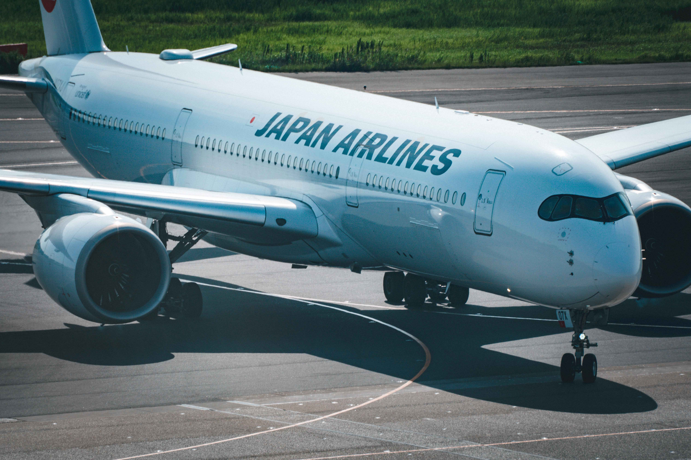
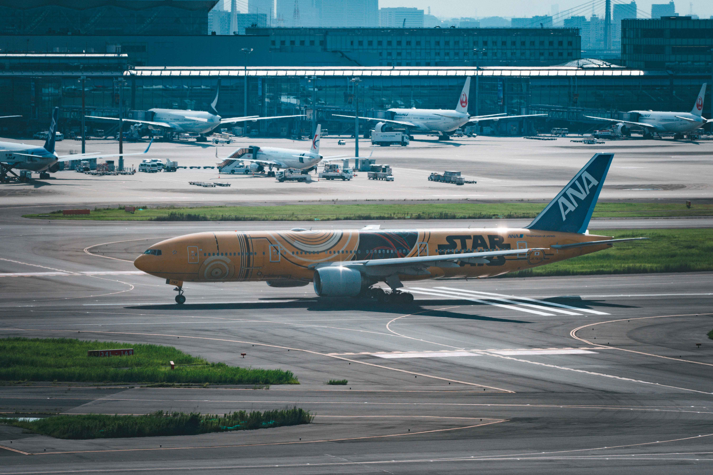

# Cabin

## Introduction

The cabin is the part of an airplane where passengers sit during the flight. It's like the main room inside the plane, with rows of seats, overhead bins for luggage, and sometimes entertainment screens. The cabin also includes areas like the aisles, restrooms, and sometimes a section for flight attendants to prepare food and drinks. It's designed to keep passengers safe and comfortable while flying high in the sky. Even a same type plane, differnet airlines can have different cabin configurations.

## Discover the Cabin Design in different airplanes
 

-    __Airbus__

    ---
    [^1]
    Cockpit of Airbus planes.

    [:octicons-arrow-right-24: Getting started](/Cabin/airbus)

-   __Boeing__

    ---
    [^2]
    Cockpit of Boeing planes.

    [:octicons-arrow-right-24: Getting started](/Cabin/boeing)

[^1]: Japan Airlines Airbus A350-900 / Photo Credit: Haixing Zhu
[^2]: All Nippon Airways Boeing 777-200 with STAR WARS Livery / Photo Credit: Haixing Zhu