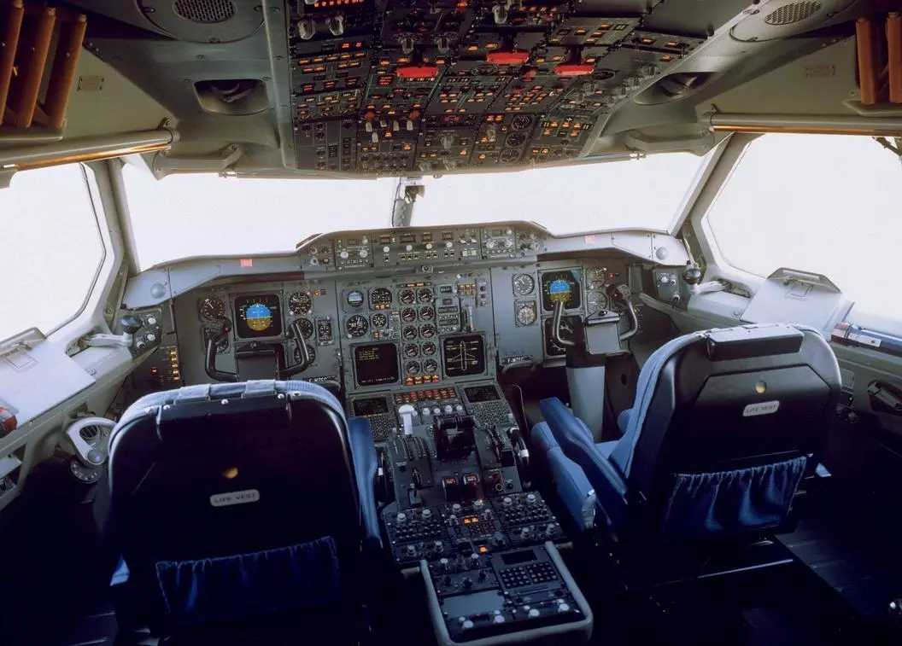
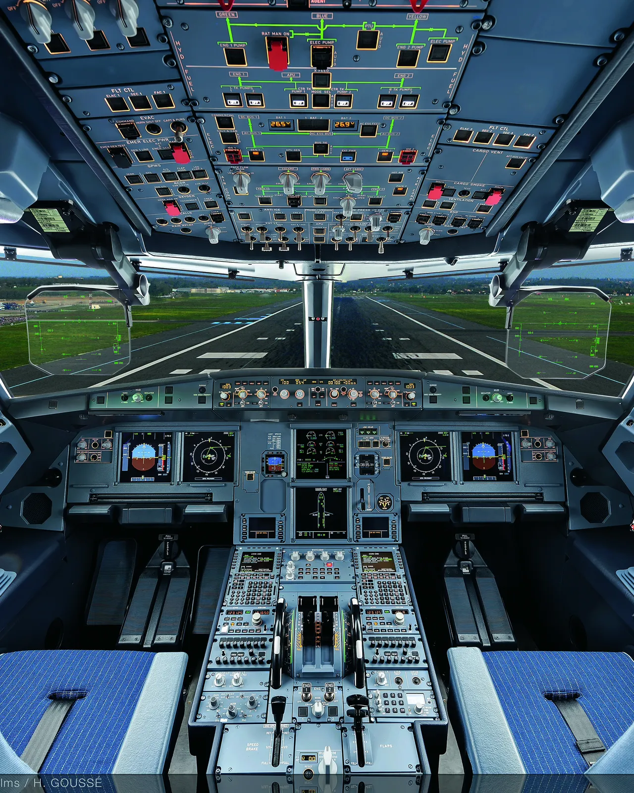
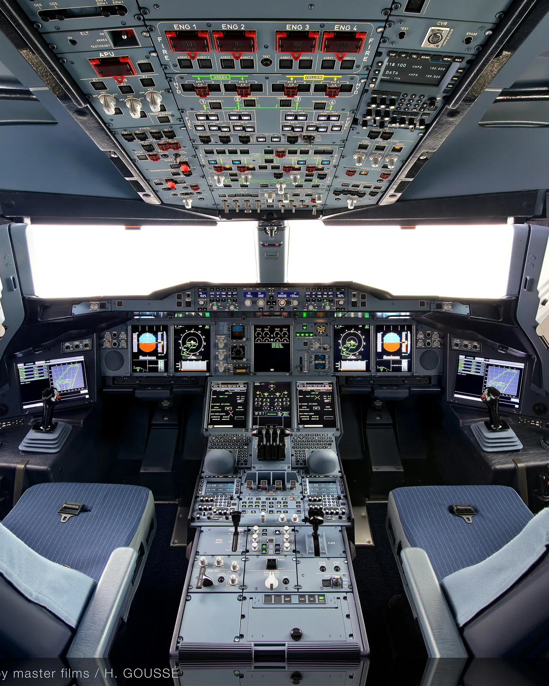
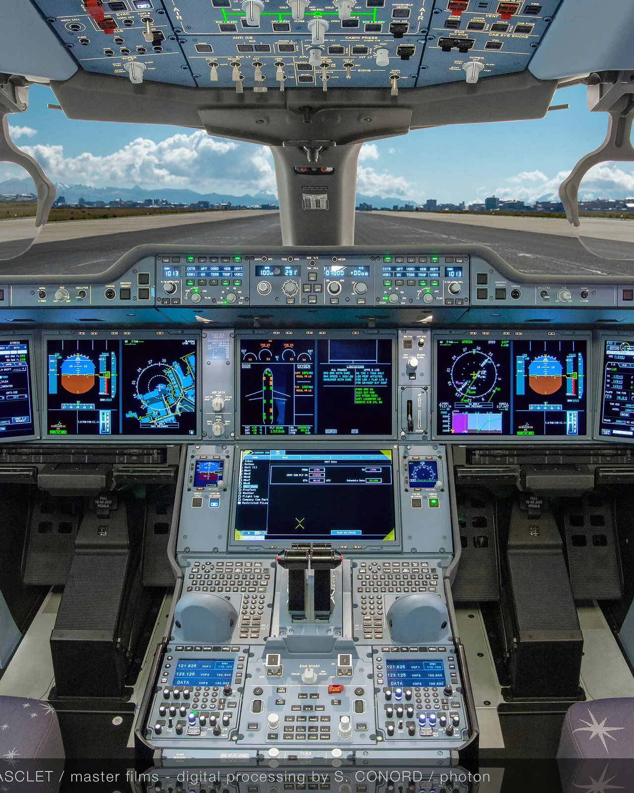
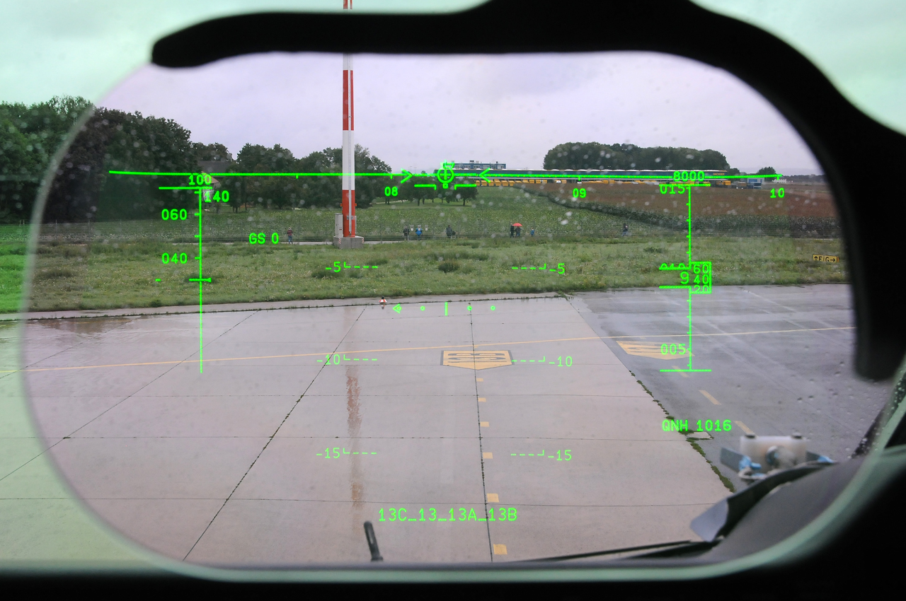

# Airbus

## Screens

In the past, cockpits had countless gauges, which were gradually replaced by electronic screens as technology progressed.

[^1]

Like what was shown in the picture, one of the oldest plane of airbus, the Airbus A310, has a cockpit with a lot of gauges.

Airbus is tring to add more screens to their cockpits, from the A320 to the A350, the number of screens has increased.

[^1]

As shown in the picture, most of the gauges in the A320 have been replaced by screens.

[^1]

The A380 has the most screens in the cockpit, which makes it easier for the pilots to control the plane.

[^1]

Although the A350 has fewer screens than the A380, the A350 uses six much larger screens. These provide plenty of space to display all flight and system information, with extra room for future updates.

### Integration

A special feature of the cockpit of the Airbus A350 is the integration of the [EFB](https://en.wikipedia.org/wiki/Electronic_flight_bag) (Electronic Flight Bag) into the Onboard Information Systems (OIS) display. The EFB is a tablet that is used to display all the information that the pilots need during the flight.[^2]

## Commonalities

The Airbus planes have almost the some layout for most of the switches and buttons, which makes it easier for the pilots to switch between different planes.

[^3]

The desgin was based on the [**fly-by-wire**]() philosophy and similar flight deck layouts.[^3]

## Head-up Display (HUD) 
 
HUD technology to provide pilots with a clear, intuitive, and unobstructed view of critical flight information. The HUD is a transparent display that projects information directly in the pilot’s line of sight, allowing them to keep their eyes on the outside world while still having access to important flight data.

[^4]

[^1]: https://www.airbus.com/en/products-services/commercial-aircraft/cockpits
[^2]: https://aircraft.airbus.com/en/5-reasons-pilots-love-flying-the-a350
[^3]: https://aircraft.airbus.com/en/more-commonality-better-integration
[^4]: https://www.flickr.com/photos/79904076@N05/15113540931