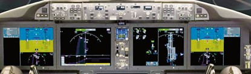
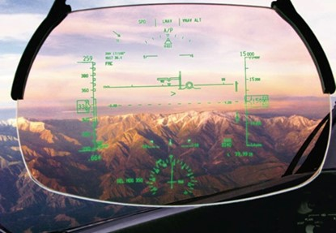

# Boeing

## Glass Cockpit

The Boeing 787 features a "glass cockpit" design, which means it uses large multifunctional screens instead of traditional dials and gauges. These screens make it easier for pilots to see and manage critical flight information in a clear and organized way.[^1]

## Intergrated EFB (Electronic Flight Bag)

Boeing collaborated with [Rockwell/Collins](https://en.wikipedia.org/wiki/Rockwell_Collins) to develop this setup, which includes [Electronic Flight Bags (EFBs)](https://en.wikipedia.org/wiki/Electronic_flight_bag) that replace traditional paper documentation with digital versions. The EFB is a tablet that is used to display all the information that the pilots need during the flight. This digital transformation enhances pilot situational awareness and allows for more efficient cockpit operations.

## Head-up Display (HUD)

HUD technology to provide pilots with a clear, intuitive, and unobstructed view of critical flight information. The HUD is a transparent display that projects information directly in the pilot’s line of sight, allowing them to keep their eyes on the outside world while still having access to important flight data.

[^1]: DeVries, Peter. ‘Boeing 787 Dreamliner: Avionics and Electronic Flight Bag’. IJSS, vol. 4, 01 2008, pp. 217–223, https://doi.org/10.1504/IJSS.2008.016634.