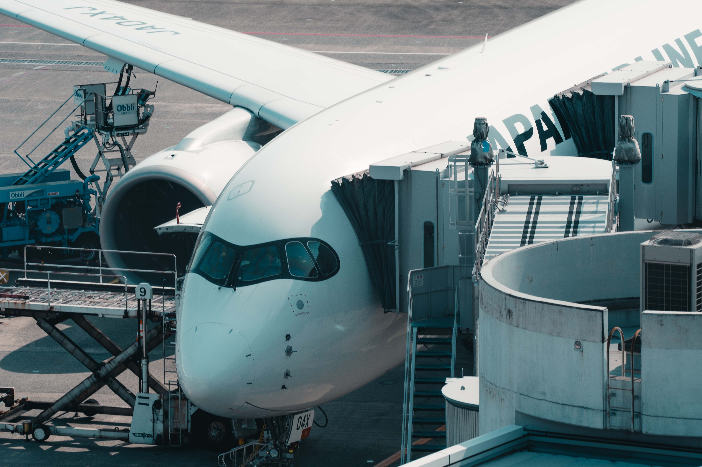
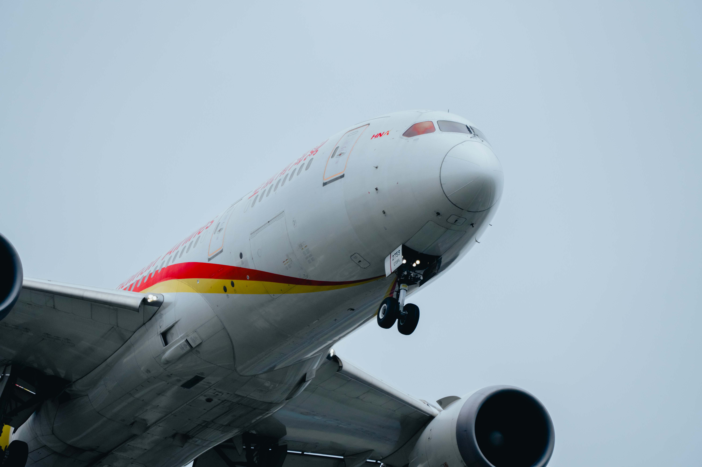

# What is a cockpit?

A cockpit is the part of an airplane where the pilots sit and control the plane. It’s like the driver’s seat in a car but for an airplane. Inside the cockpit, you’ll find all the tools and screens the pilots need to fly the plane, like controls for steering, buttons for adjusting speed, and screens showing information about the flight.

# Discover the cockpit in different airplanes

-    __Airbus__

    ---
    [^1]
    Cockpit of Airbus planes.

    [:octicons-arrow-right-24: Getting started](#)

-   __Boeing__

    ---
    [^1]
    Cockpit of Boeing planes.

    [:octicons-arrow-right-24: Getting started](#)

[^1]: Photo Credit: Haixing Zhu