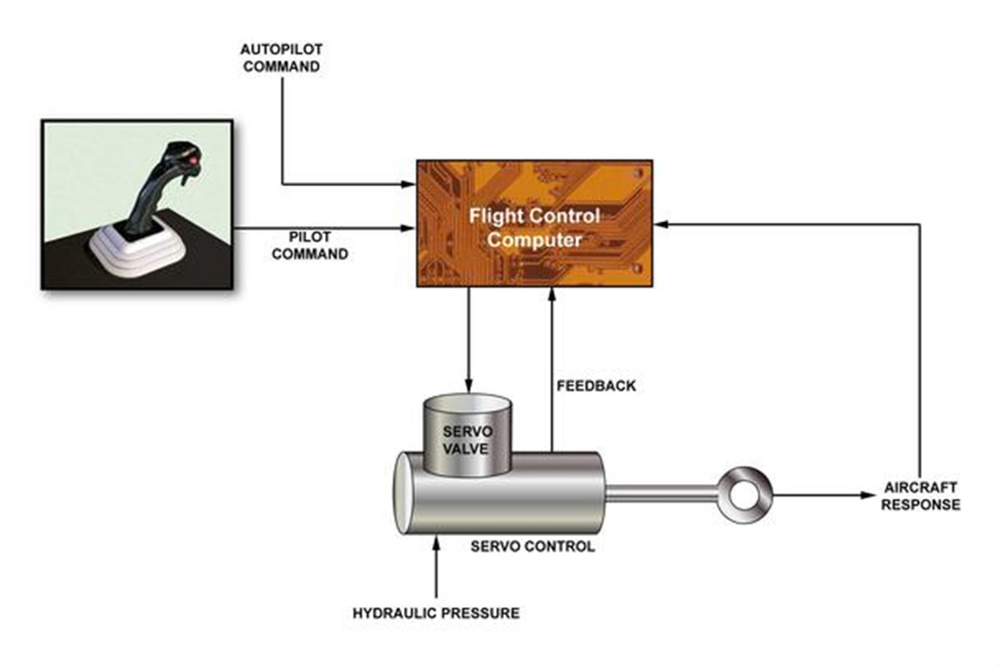
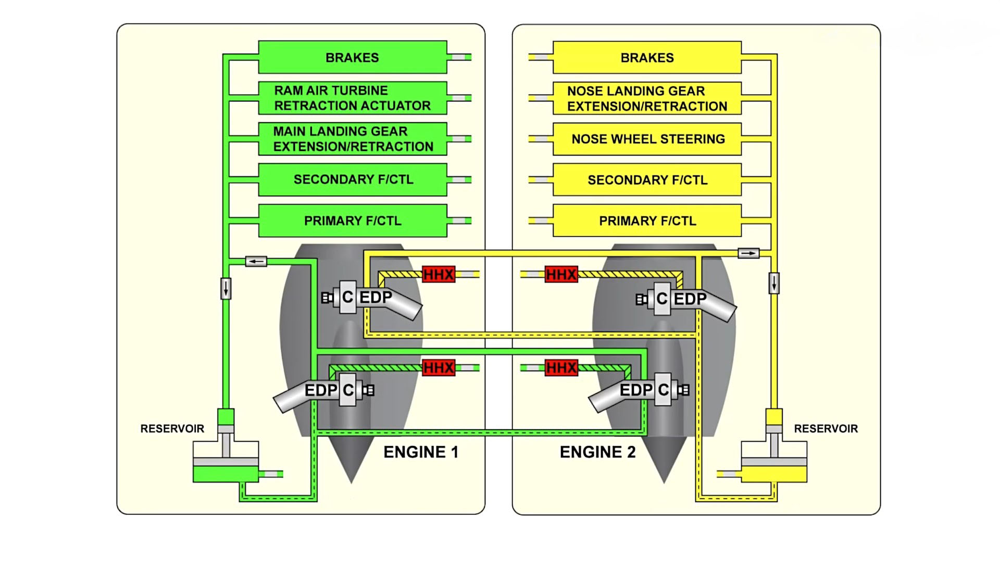

# The Control System of Airbus

## Fly-By-Wire

A big step forward in airplane technology is the "fly-by-wire" (FBW) system. Instead of using the traditional manual controls with cables and pulleys, FBW uses an electronic system to control the airplane. When a pilot moves the controls, the actions are turned into electronic signals, which are sent to computers. These computers figure out how to move the parts of the airplane, like the wings or tail, to respond to the pilot's commands.

Airbus started using FBW on the A310 and A300-600 for secondary controls, replacing the old system of cables and pulleys. The A320 was the first plane to use a full FBW system, which played a big role in making it the best-selling jetliner family in history.[^1]

## Backup Systems

A backup system in an airplane is like a safety net. Its main job is to ensure that the plane can still be controlled and flown safely if the main system fails. For example, in a fly-by-wire (FBW) system, the backup might include mechanical controls or additional electronic systems. These backups make sure the pilots can keep flying the plane even if there's a problem with the primary controls. This extra layer of safety is essential to protect the aircraft, passengers, and crew in case of unexpected issues.

### What Airbus did on A350?

Airbus made the system on the A350 simpler and more efficient by building on what they learned from the A380. Instead of having a separate hydraulic backup system, the A350 uses two electrically powered hydraulic pumps on its engines. Since the A350 has only two engines, this setup makes the design lighter and easier to maintain while still being reliable.[^2]

[^1]: https://www.airbus.com/en/our-history/commercial-aircraft-history/fly-by-wire-1980-1987
[^2]: https://www.youtube.com/watch?v=kRVg-wyYm2A