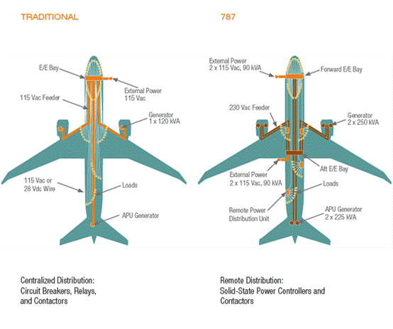

# The Control System of Boeing

## Fly-By-Cable

Cables and pulleys were the traditional way to control airplanes. When a pilot moved the controls, the cables and pulleys would move the parts of the airplane, like the wings or tail, to respond to the pilot's commands. This system was used on many older planes, like the Boeing 747 and 737. The system were usually accompanied by hydraulic systems to help move the control surfaces.[^1]

## Boeing's Fly-By-Wire System

Boeing first used the fly-by-wire (FBW) system on the Boeing 777. Boeing replaced most of cable with wires. Unlike Airbus, Boeing designed its system so that pilots could fully override the computer controls if needed, even flying the plane beyond its normal safety limits.[^1]

The Boeing 787 was designed to replace some traditional hydraulic and pneumatic systems with electric ones. This makes the planes more efficient, reliable, and safer. Instead of using engine air to power hydraulic pumps for systems like cabin pressurization, it uses electric compressors. The 787’s electrical system runs at 230 volts AC, compared to the usual 115 volts in older planes. This higher voltage means fewer and lighter cables are needed, which reduces weight and makes the plane more efficient and dependable.[^2]

[^1]: https://www.youtube.com/watch?v=SDWd6rMWhg8
[^2]: https://www.youtube.com/watch?v=LQ-ZgpWcN2Y&t=3s

