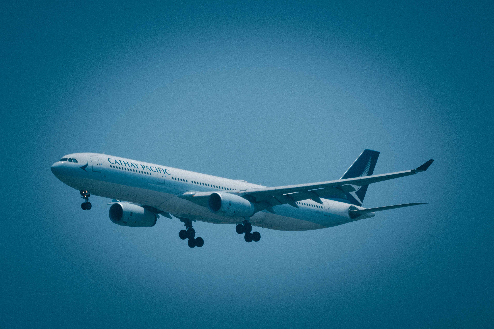
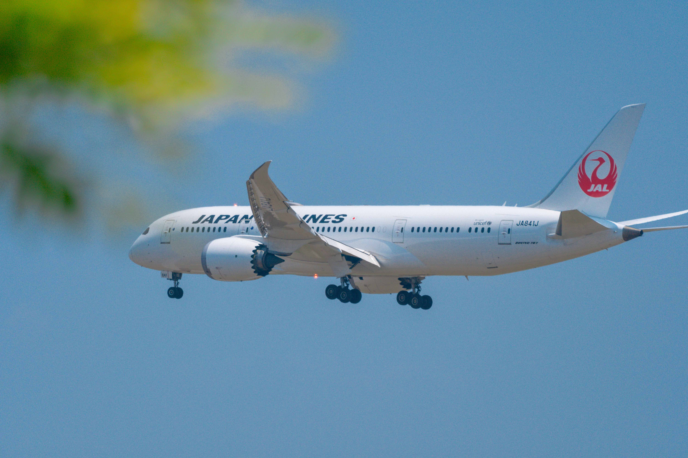

# Control System

## What is Control System?

An airplane's control system is like its "steering and brakes." It helps the pilots move and control the airplane. When a pilot pushes or pulls on the control stick, turns the wheel, or presses the pedals, these actions are sent through cables, hydraulics, or electronic signals to move parts of the airplane, like the wings (ailerons), tail (elevators and rudder), or even the flaps.

## Discover the Control System in different airplanes
 

-    __Airbus__

    ---
    [^1]
    Cockpit of Airbus planes.

    [:octicons-arrow-right-24: Getting started](/Control-System/airbus)

-   __Boeing__

    ---
    [^2]
    Cockpit of Boeing planes.

    [:octicons-arrow-right-24: Getting started](/Control-System/boeing)

[^1]: Cathay Pacific Airbus A330-300 / Photo Credit: Haixing Zhu
[^2]: Japan Airlines Boeing 787-8 / Photo Credit: Haixing Zhu
